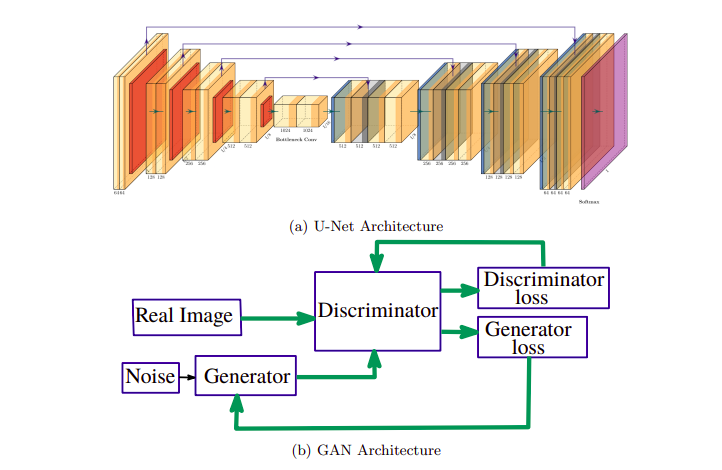
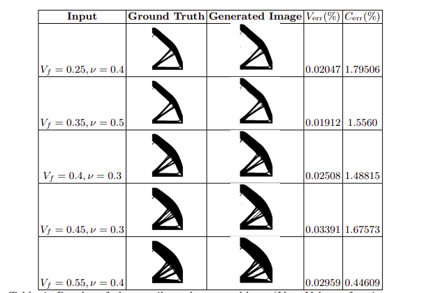

# GenAI_Struct_Optimization

This repository contains the implementation of a **Generative AI–based structural optimization framework** using **conditional Generative Adversarial Networks (cGANs)**.  
The goal of the project is to automatically optimize geometric designs of 2D structural elements (flat plates) under various mechanical and thermal loading conditions.

---

## 📌 Project Overview

Structural optimization typically requires computationally expensive simulation cycles involving iterative design, analysis, and refinement.  
This project explores whether **Generative Adversarial Networks (GANs)** can learn this design-to-performance mapping and produce optimized geometries directly from input stress/thermal information.

The workflow involves:

- Generating a **custom dataset** of structural plates using **Abaqus**  
- Performing **stress and thermal analysis** on the plates  
- Training multiple **GAN-based models** to learn the mapping between input fields and optimized geometry  
- Evaluating generative quality and optimization consistency

---

## 🧠 Models Implemented

### 🔹 **Pix2Pix (Image-to-Image Translation GAN)**
- Learns a direct mapping from input (e.g., stress maps/shape constraints) to optimized structure  
- Produces interpretable and high-resolution outputs  

### 🔹 **Conditional GAN (cGAN)**
- Introduces conditioning variables to control generation outcomes  
- Enables flexible design manipulation based on constraints  

### 🔹 **CycleGAN / CCGAN**
- Enables domain translation between geometric and optimized domains without requiring paired data  
- Handles unpaired and heterogeneous datasets effectively  

All models were implemented and trained in **TensorFlow**.

---

## 🛠 Dataset Creation (Abaqus)

A fully custom dataset was created using **Abaqus CAE**, consisting of:
- 2D **flat plate geometries**  
- Applied **stress**, **thermal**, and **mixed-load** conditions  
- Output fields collected:
  - Stress distributions  
  - Deformation fields  
  - Temperature gradients  
- Labeled geometric designs for optimization learning  

This dataset forms the foundation for supervised and unsupervised GAN training.

---

## 🚀 Training Pipeline

1. Preprocess Abaqus-generated images into paired (or unpaired) datasets  
2. Train Pix2Pix, cGAN, and CCGAN models using TensorFlow  
3. Evaluate generated designs on:
   - Structural quality  
   - Visual shape consistency  
   - Learned optimization patterns  
4. Compare model performance on unseen test samples  

---

## 📊 Results

Below is a sample of generated outputs from the trained models:

The GANs successfully learned high-level geometric transformations required for structural optimization.  
Pix2Pix gave the most stable outputs, while CCGAN offered flexibility in unpaired data situations.

---

## 📂 Repository Structure (Suggested)

